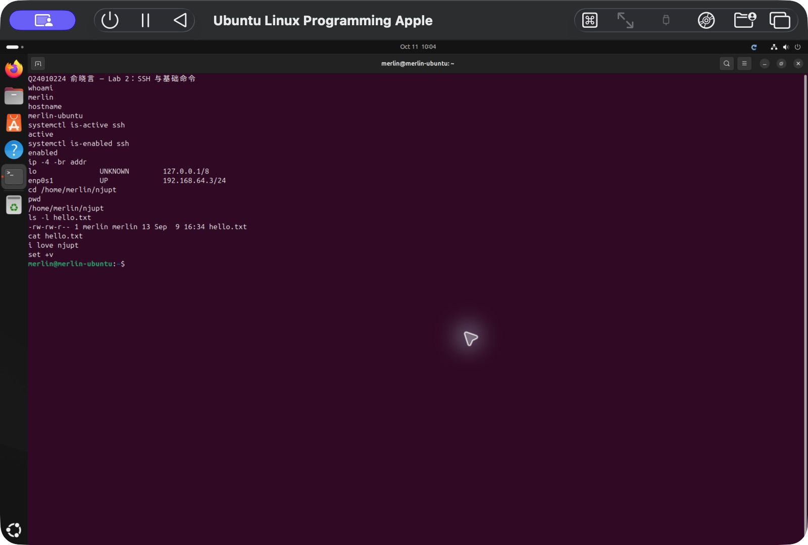

# 实验 02：SSH 远程连接与 Linux 基础命令

## 实验信息

- 学生：俞晓言
- 学号：Q24010224
- 日期：2026 年 9 月 8 日
- 客户端：macOS 终端
- 服务器：UTM 中的 Ubuntu 24.04.4 LTS ARM64
- Linux 主机名：`merlin-ubuntu`
- Linux 用户：`merlin`

## 实验目标

1. 理解 SSH 客户端和服务器之间的关系。
2. 在 Ubuntu 中运行 OpenSSH Server，允许主机远程访问虚拟机。
3. 从 macOS 终端登录 Ubuntu，并区分本机 Shell 与远程 Shell。
4. 练习目录定位、文件创建、输出重定向和文件内容查看等基础操作。

## 实验环境与网络

Ubuntu 虚拟机使用 UTM 共享网络（NAT），网卡为 `enp0s1`。实验时获得的 IPv4 地址为：

```text
192.168.64.3/24
```

其网络路径为：

```text
Ubuntu 虚拟机 192.168.64.3
        → UTM 虚拟网关 192.168.64.1
        → macOS 主机
        → 外部网络
```

这种模式下，Mac 为 Ubuntu 提供 NAT 转发，但 Ubuntu 仍然是一台独立的 Linux 主机，有自己的 IP 地址、用户、文件系统和网络服务。该 IP 由 DHCP 分配，虚拟机重启或网络环境变化后可能发生改变。

Ubuntu 中可使用下列命令查看地址：

```bash
ip -4 -br addr
```

`ipconfig` 是 Windows 命令，不适用于 Ubuntu。`ifconfig` 在 Linux 中仍可使用，但现代 Linux 系统更推荐 `ip` 命令。

## SSH 服务与远程登录

### 1. 服务端

Ubuntu 是 SSH 服务器。所需软件包为 `openssh-server`，实验中已确认 `ssh` 服务处于 `active` 状态，并设置为开机启动。

常用检查命令：

```bash
systemctl is-active ssh
systemctl status ssh
```

其中第一条命令适合快速确认服务是否正常，预期输出为：

```text
active
```

### 2. 客户端

课件中使用 PuTTY、Xshell 或 SecureCRT，主要是为 Windows 环境提供 SSH 客户端。macOS 自带 `ssh` 命令，因此可直接在 Mac 终端中连接：

```bash
ssh merlin@192.168.64.3
```

命令的基本形式是：

```text
ssh 用户名@主机地址
```

连接成功后，终端提示符由 macOS 中的：

```text
(base) ➜  ~
```

变为 Ubuntu 中的：

```text
merlin@merlin-ubuntu:~$
```

这个变化表明当前输入的命令将由 Ubuntu 执行，而不是由 Mac 执行。

### 3. 扩展实践：SSH 公钥认证

完成密码登录验证后，进一步将 Mac 上已有的 Ed25519 SSH 公钥安装到 Ubuntu 用户的 `~/.ssh/authorized_keys` 中。配置后使用下列命令即可登录：

```bash
ssh merlin@192.168.64.3
```

公钥认证时，客户端保留私钥，服务器只保存对应的公钥。登录过程通过密码学签名证明客户端持有私钥，不需要在网络中传送用户密码。实验中已使用 SSH 的非交互模式再次连接虚拟机，确认公钥登录成功。

## 基础文件操作

登录 Ubuntu 后，依次执行了以下命令：

```bash
pwd
ls
mkdir njupt
cd njupt
touch hello.txt
ls
echo "i love njupt" > hello.txt
cat hello.txt
```

### 命令作用

| 命令 | 作用 | 本次结果 |
| --- | --- | --- |
| `pwd` | 显示当前工作目录 | `/home/merlin` |
| `ls` | 列出目录内容 | 列出用户主目录，后续确认 `hello.txt` 已创建 |
| `mkdir njupt` | 创建目录 | 创建 `/home/merlin/njupt` |
| `cd njupt` | 进入指定目录 | 当前目录变为 `~/njupt` |
| `touch hello.txt` | 创建空文件，或更新已有文件的时间戳 | 创建 `hello.txt` |
| `echo "i love njupt"` | 将文字输出到标准输出 | 文字只显示在终端 |
| `>` | 将标准输出重定向到文件 | 将文字写入并覆盖 `hello.txt` |
| `cat hello.txt` | 读取文件并输出内容 | 显示 `i love njupt` |

最终得到的文件路径为：

```text
/home/merlin/njupt/hello.txt
```

文件内容为：

```text
i love njupt
```

## 问题与分析

### 1. SSH 命令顺序错误

曾输入：

```bash
merlin@ssh 192.168.64.3
```

Shell 会把 `merlin@ssh` 当成要执行的命令，因此报告 `command not found`。正确语法是先写命令 `ssh`，再写由用户名和主机地址组成的参数。

### 2. `mkdir` 拼写错误

曾将 `mkdir` 写成 `mddir`。Shell 不能找到该命令，因此给出了相似命令和安装软件包的建议。这种建议不意味着系统缺少软件；对基础命令应先检查拼写。

系统提示中的：

```text
sudo apt install <deb name>
```

`<deb name>` 是软件包名称的占位符，不能连同尖括号原样输入。在 Bash 中，`<` 和 `>` 还具有重定向含义，原样输入会产生语法错误。

## 实验截图



## 实验结论

本次实验成功建立了从 macOS 主机到 UTM Ubuntu 虚拟机的 SSH 连接，并在远程 Shell 中完成了目录创建、文件创建、输出重定向和文件读取。

通过实验可以看出，SSH 并不是把 Ubuntu “搬到” Mac 上运行，而是从 Mac 上的客户端向 Ubuntu 的 SSH 服务发送命令，命令仍由 Ubuntu 执行。终端提示符、当前目录和网络地址是判断当前操作环境的重要依据。

后续课程中可继续使用这套环境进行 C/C++ 程序编译、调试、进程与系统调用实验。需要纳入课程验收的成果，应另行整理到 `linux2026/Q24010224-俞晓言/` 中并持续提交。
