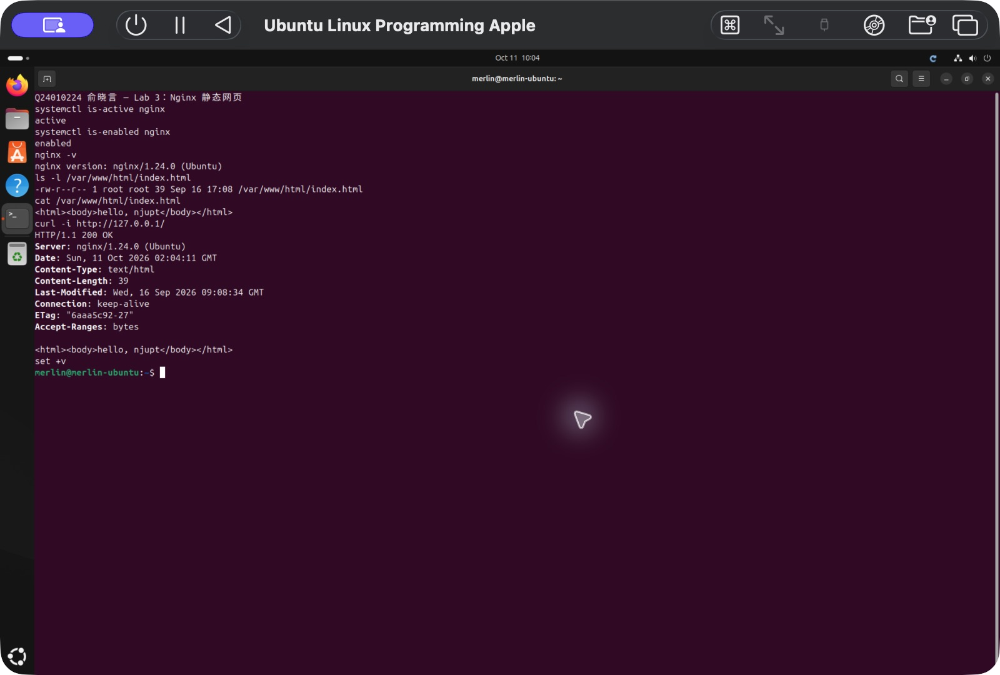
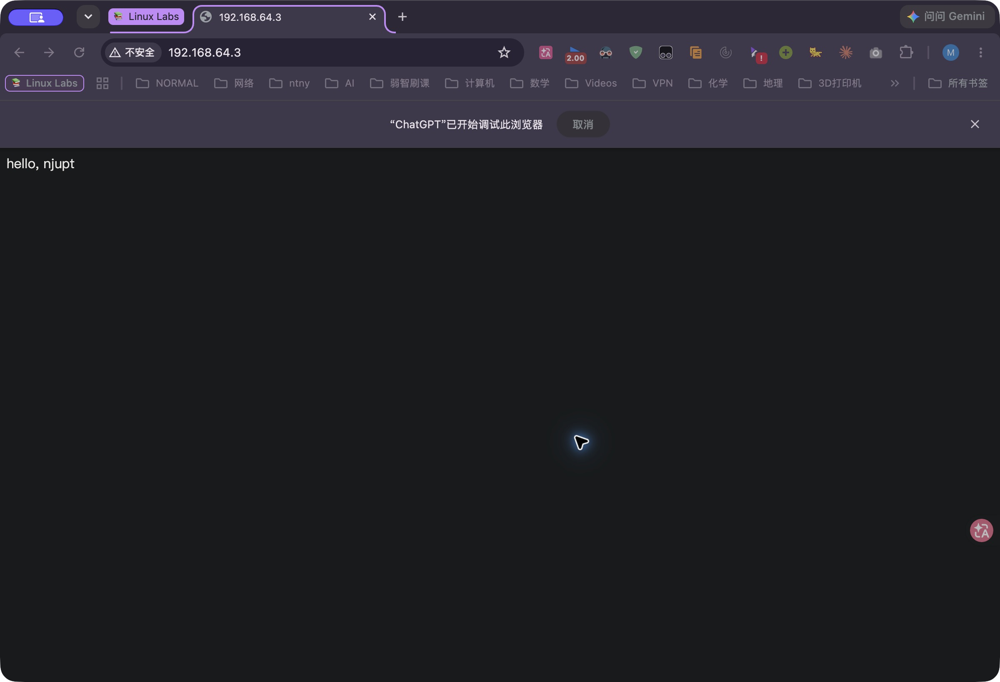

# 实验 03：Nginx 服务器搭建与静态网页部署

## 实验信息

- 学生：俞晓言
- 学号：Q24010224
- 完成日期：2026 年 9 月 16 日
- 客户端：macOS 终端、Google Chrome
- 服务器：UTM 中的 Ubuntu 24.04.4 LTS ARM64
- Linux 主机名：`merlin-ubuntu`
- Linux 用户：`merlin`
- Web 服务器：Nginx 1.24.0

## 实验目标

1. 在 Ubuntu 中安装并启动 Nginx Web 服务器。
2. 理解 Web 服务器监听端口、HTTP 请求和客户端访问之间的关系。
3. 从 Ubuntu 本机和 macOS 主机分别验证 Nginx 服务。
4. 在 Nginx 网站根目录中部署自定义静态首页。
5. 通过分层排查定位浏览器无法访问局域网服务的原因。

## 实验环境与访问路径

Ubuntu 虚拟机使用 UTM 共享网络（NAT），网卡为 `enp0s1`。实验时的 IPv4 地址为 `192.168.64.3/24`。

```text
Google Chrome / curl（macOS）
             │ HTTP，TCP 80
             ▼
UTM 共享网络 192.168.64.0/24
             │
             ▼
Ubuntu 192.168.64.3:80
             │
             ▼
           Nginx
             │
             ▼
  /var/www/html/index.html
```

虚拟机地址通过下列命令确认：

```bash
ip -4 -br addr
```

输出：

```text
lo       UNKNOWN  127.0.0.1/8
enp0s1   UP       192.168.64.3/24
```

## 实验过程

### 1. 更新软件包索引

首先更新 APT 本地软件包索引：

```bash
sudo apt update
```

命令成功从 Ubuntu `noble`、`noble-updates`、`noble-backports` 和 `noble-security` 软件源获取索引。输出中提示有其他系统软件包可升级，但这与本次 Nginx 实验无关，因此未在实验中执行全量升级。

### 2. 安装 Nginx

执行：

```bash
sudo apt install nginx
```

本次安装了 `nginx` 和 `nginx-common` 两个新软件包，版本为 `1.24.0-2ubuntu7.18`。安装过程创建了以下符号链接：

```text
/etc/systemd/system/multi-user.target.wants/nginx.service
    → /usr/lib/systemd/system/nginx.service
```

这表明 Nginx 已加入 `multi-user.target`，可在系统启动时自动启动。

### 3. 验证服务状态

分别检查 Nginx 的运行状态和开机启动状态：

```bash
systemctl is-active nginx
systemctl is-enabled nginx
```

输出：

```text
active
enabled
```

`active` 表示服务当前正在运行，`enabled` 表示已启用开机自动启动。

### 4. 从 Ubuntu 本机验证 HTTP 响应

使用回环地址访问 Ubuntu 自己的 Nginx：

```bash
curl -I http://127.0.0.1
```

关键响应头为：

```text
HTTP/1.1 200 OK
Server: nginx/1.24.0 (Ubuntu)
Content-Type: text/html
Content-Length: 615
```

HTTP 状态码 `200` 说明 Nginx 已正常处理请求。`127.0.0.1` 是 Ubuntu 自己的回环地址，这一步只能证明 Web 服务在 Ubuntu 内部正常。

### 5. 从 macOS 主机访问 Nginx

在 Mac 浏览器中访问：

```text
http://192.168.64.3/
```

此处必须使用 Ubuntu 在 UTM 共享网络中的地址，不能使用 `127.0.0.1`。Mac 中的 `127.0.0.1` 只代表 Mac 自己。

权限问题修复后，Chrome 成功显示 Nginx 默认页面 `Welcome to nginx!`。

### 6. 查看网站根目录

Nginx 在 Ubuntu 中的默认网站根目录为 `/var/www/html`。查看目录内容：

```bash
ls -l /var/www/html
```

初始输出：

```text
total 4
-rw-r--r-- 1 root root 615 Sep 16 16:45 index.nginx-debian.html
```

默认首页归 `root` 用户和 `root` 组所有，普通用户 `merlin` 没有在该目录中直接写入文件的权限。

### 7. 部署自定义首页

不进入持续的 root Shell，而是仅为编辑命令提升权限：

```bash
sudo vim /var/www/html/index.html
```

写入以下内容：

```html
<html><body>hello, njupt</body></html>
```

保存后的文件信息：

```text
-rw-r--r-- 1 root root 39 Sep 16 17:08 /var/www/html/index.html
```

Nginx 会优先使用新建的 `index.html`，因此不需要删除原有的 `index.nginx-debian.html`，也不需要重启 Nginx。

### 8. 验证自定义页面

在 Ubuntu 中验证：

```bash
curl http://127.0.0.1/
```

在 Mac 中验证：

```bash
curl http://192.168.64.3/
```

两处均输出：

```html
<html><body>hello, njupt</body></html>
```

Mac 请求返回的关键响应头为：

```text
HTTP/1.1 200 OK
Server: nginx/1.24.0 (Ubuntu)
Content-Length: 39
```

刷新 Chrome 后，页面显示 `hello, njupt`，说明自定义静态首页已成功部署。

## 问题排查：Chrome 无法访问局域网服务

### 现象

Nginx 安装后，Chrome 访问 `http://192.168.64.3/` 时报错：

```text
ERR_ADDRESS_UNREACHABLE
```

### 分层检查

1. SSH 能够连接 `192.168.64.3`，说明 Mac 和 Ubuntu 之间的基本网络可达。
2. Ubuntu 中 `curl http://127.0.0.1/` 返回 `200 OK`，说明 Nginx 应用层正常。
3. Nginx 监听 `0.0.0.0:80` 和 `[::]:80`，说明服务不是只绑定在回环地址。
4. Mac 终端可连接 `192.168.64.3:80`，并且 `curl` 返回 `200 OK`，说明 TCP 80 端口和 HTTP 路径均正常。
5. 故障仅出现在 Chrome，因此将排查范围缩小到浏览器及 macOS 应用权限。

### 根本原因与修复

macOS 的以下设置中，`Google Chrome.app` 的开关处于关闭状态：

```text
系统设置
  → 隐私与安全性
  → 本地网络
  → Google Chrome.app
```

该权限关闭时，macOS 阻止 Chrome 与局域网设备通信，但不会影响已获权限的终端应用，因此出现了“终端可访问、Chrome 不可访问”的现象。开启 Chrome 的本地网络权限并刷新页面后，Nginx 默认页面立即正常显示。

这一故障与 Clash 是否开启无关。局域网地址本应直连，但应用程序仍需获得 macOS 的本地网络权限。

## 关于 root 权限

课件使用 `sudo su root` 进入持续的 root Shell。在隔离的课程虚拟机中短时使用该方式并非不可以，但之后输入的每条命令都将拥有最高权限，拼写或路径错误的影响会被放大，也可能忘记及时退出 root 身份。

本次只需修改一个受保护文件，因此使用 `sudo vim ...` 仅为这一条命令授权。这符合最小权限原则，同时完成与课件相同的实验目标。

## 实验截图





## 实验结论

本次实验完成了 Nginx 的安装、服务状态检查、Ubuntu 本机访问、macOS 远程访问和自定义静态首页部署。最终从 Ubuntu、Mac 终端和 Chrome 三个角度均验证了 `hello, njupt` 页面。

实验还展示了一个完整的分层排查过程：先检查 IP 可达性，再检查服务运行状态、监听端口和 HTTP 响应，最后将问题缩小到特定客户端应用。相比盲目重装 Nginx 或关闭系统安全功能，这种方法能更准确地确定故障边界和根本原因。
