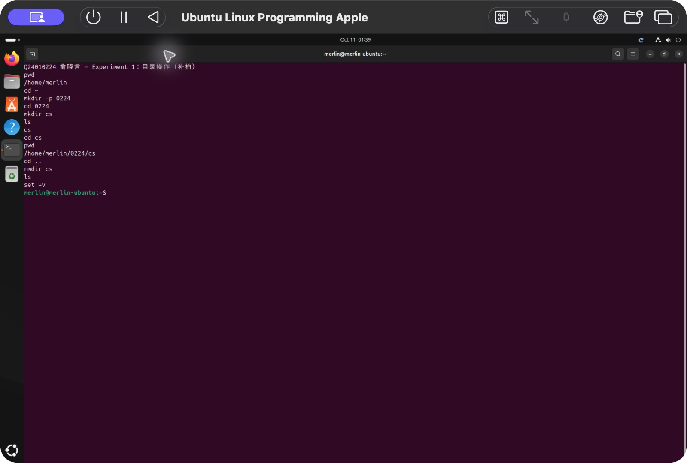
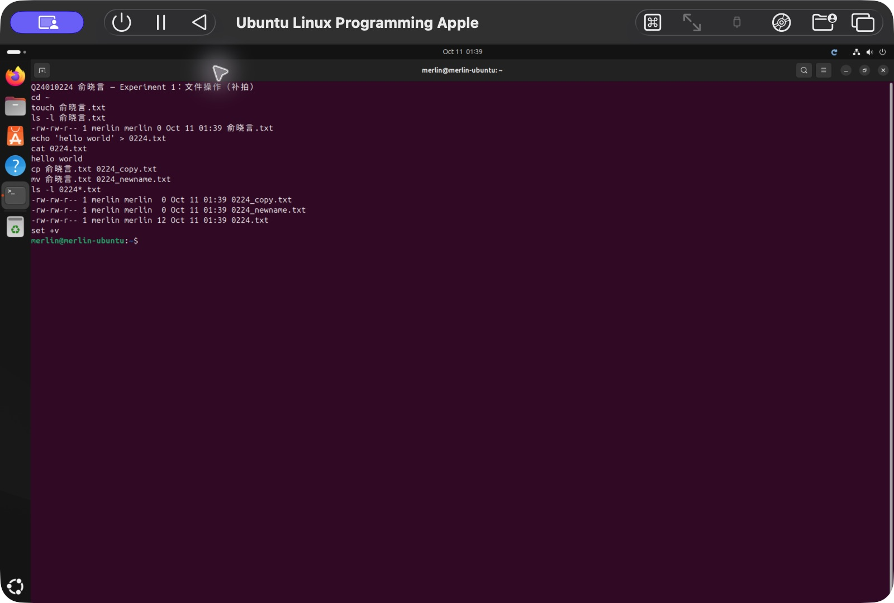
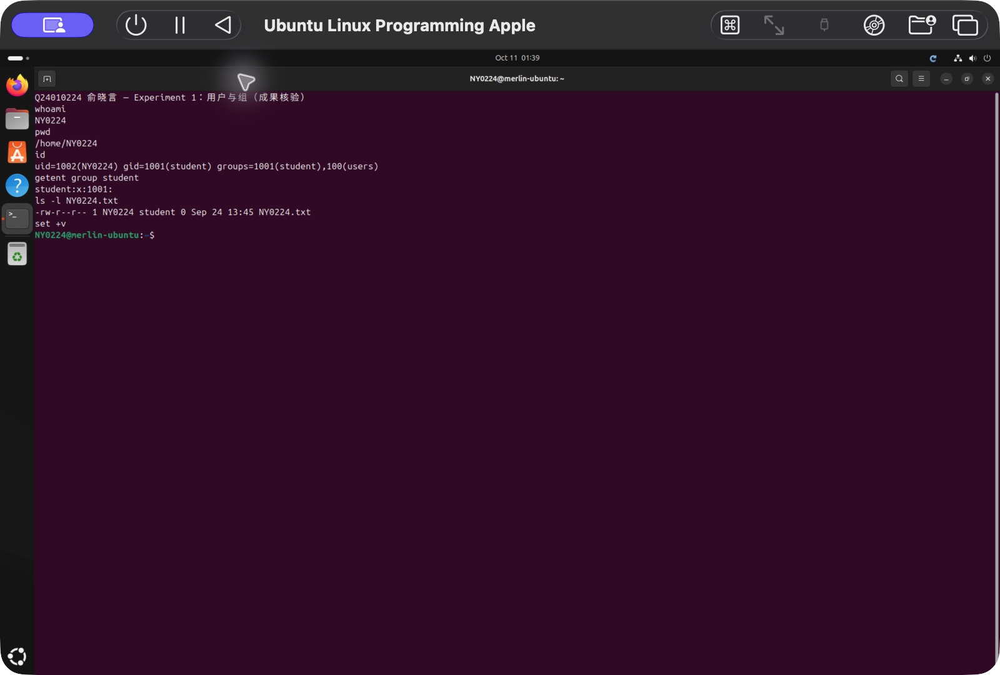
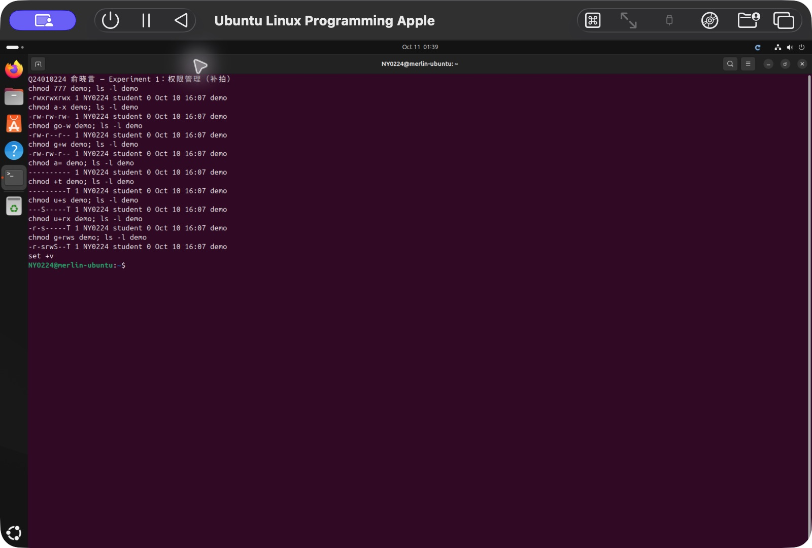
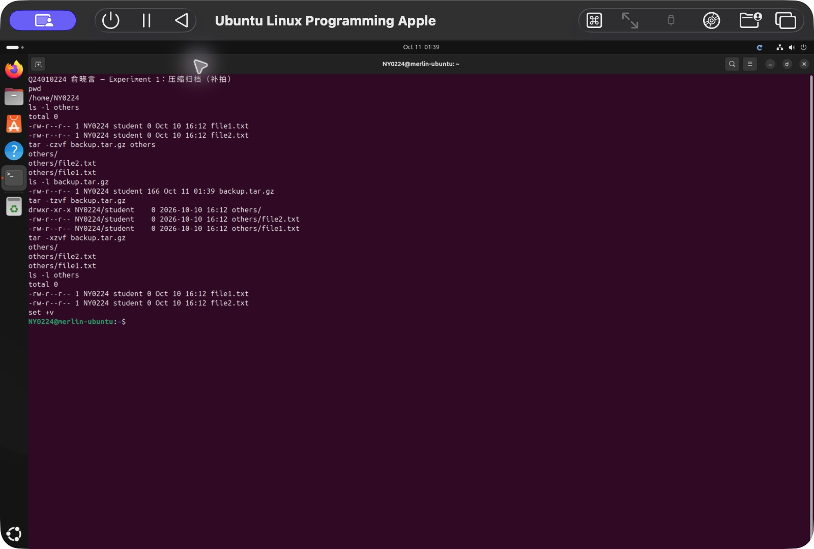
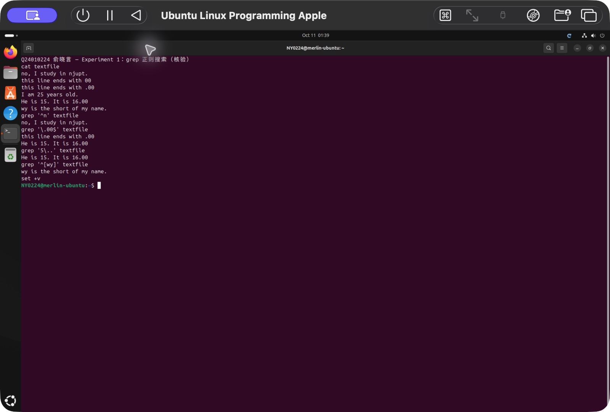

# Experiment 1：Linux 基础操作综合实验

- 姓名：俞晓言
- 学号：Q24010224
- 实验完成日期：2026 年 10 月 10 日
- 环境：macOS iTerm，经 SSH 连接 UTM Ubuntu 24.04.4 LTS ARM64
- 普通用户：merlin；实验用户：NY0224；实验用户主组：student

## 1. 目录操作

以 merlin 用户执行：

```bash
echo 'Q24010224 俞晓言 — Experiment 1：目录操作'
pwd
cd ~
mkdir 0224
cd 0224
mkdir cs
ls
cd cs
cd ..
ls
rmdir cs
ls
```

主目录为 `/home/merlin`。创建后 `ls` 显示 `cs`，删除后没有输出。`cd ..` 返回父目录，`rmdir` 只能删除空目录。成果目录 `/home/merlin/0224` 已核验存在。



## 2. 文件操作

```bash
cd ~
touch 俞晓言.txt
ls
echo 'hello world' > 0224.txt
cat 0224.txt
cp 俞晓言.txt 0224_copy.txt
mv 俞晓言.txt 0224_newname.txt
ls
```

`0224.txt` 内容为 `hello world`；`0224_copy.txt` 和 `0224_newname.txt` 均为空文件。`cp` 复制文件，`mv` 在本步骤重命名文件，`>` 将输出写入文件并覆盖已有内容。三个文件均已通过 SSH 核验。



## 3. 用户与组管理

```bash
whoami
sudo su root
whoami
groupadd student
adduser --allow-bad-names NY0224
usermod -g student NY0224
id NY0224
su - NY0224
whoami
pwd
touch NY0224.txt
ls -l NY0224.txt
```

直接执行 `adduser NY0224` 时，默认用户名规则拒绝了大写字母。按照命令提示使用 `--allow-bad-names` 创建课件要求的账号。创建期间忘记密码，随后以 root 执行 `passwd NY0224` 重新设置。

核验结果：

```text
uid=1002(NY0224) gid=1001(student) groups=1001(student),100(users)
/home/NY0224
-rw-r--r-- 1 NY0224 student 0 Sep 24 13:45 NY0224.txt
```

`usermod -g` 修改主组，`su -` 切换用户并加载其登录环境。文件属主为 NY0224，属组为 student。



## 4. 权限管理

创建 `demo` 后，逐次执行下表命令，每次使用 `ls -l demo` 查看结果：

| 命令 | 实际权限 | 含义 |
| --- | --- | --- |
| `chmod 777 demo` | `-rwxrwxrwx` | 三类用户均有读、写、执行权限 |
| `chmod a-x demo` | `-rw-rw-rw-` | 移除所有人的执行权限 |
| `chmod go-w demo` | `-rw-r--r--` | 移除组和其他人的写权限 |
| `chmod g+w demo` | `-rw-rw-r--` | 添加组写权限 |
| `chmod a= demo` | `----------` | 清除普通权限 |
| `chmod +t demo` | `---------T` | 添加 sticky bit |
| `chmod u+s demo` | `---S-----T` | 添加 setuid |
| `chmod u+rx demo` | `-r-s-----T` | 添加属主读、执行权限 |
| `chmod g+rws demo` | `-r-srwS--T` | 添加组读、写和 setgid |

`u/g/o/a` 分别表示属主、所属组、其他人和所有人；`+/-/=` 分别表示添加、移除和赋值。数字权限中 `r=4`、`w=2`、`x=1`。特殊权限借用执行权限位置显示，小写 `s/t` 表示对应执行权限存在，大写 `S/T` 表示不存在。重复执行最后一条添加命令未改变结果。



## 5. 压缩与归档

```bash
cd ~
mkdir others
cd others
touch file1.txt file2.txt
ls -l
cd ..
tar -czvf backup.tar.gz others
ls -l
tar -tzvf backup.tar.gz
tar -xzvf backup.tar.gz
ls -l
ls -l others
```

归档文件为 166 字节，内部包含 `others/`、`others/file1.txt`、`others/file2.txt`。两个源文件为空文件。解包成功，文件列表不变，因为在原目录中将归档内容写回了同名路径。

`tar` 中 `c` 表示创建，`x` 表示提取，`t` 表示列出内容，`z` 表示使用 gzip，`v` 表示显示处理过程，`f` 指定归档文件名。课件的目录描述容易导致在 `others` 内再次寻找 `others`，本实验返回父目录后打包。



## 6. grep 正则搜索

使用 `nano textfile` 写入课件给定的六行文本：

```text
no, I study in njupt.
this line ends with 00
this line ends with .00
I am 25 years old.
He is 15. It is 16.00
wy is the short of my name.
```

| 命令 | 实际输出 |
| --- | --- |
| `grep '^n' textfile` | `no, I study in njupt.` |
| `grep '\.00$' textfile` | `this line ends with .00`；`He is 15. It is 16.00` |
| `grep '5\..' textfile` | `He is 15. It is 16.00` |
| `grep '^[wy]' textfile` | `wy is the short of my name.` |

`^` 锚定行首，`$` 锚定行尾，`\.` 表示字面点号，未转义的 `.` 表示任意单个字符，`[wy]` 表示 w 或 y。第三条匹配 `15. It` 中的 `5.` 及紧随的空格。使用英文单引号，并在表达式与文件名之间保留空格。



## 7. 实验总结

六部分操作均已完成，SSH 核验确认了账号、主组、文件归属、最终权限、压缩包内容和四条 grep 输出。

通过本实验，掌握了目录和文件的基本操作、用户与主组的管理、普通权限与特殊权限的设置、文件归档和解包，以及使用 grep 进行正则搜索的方法。
